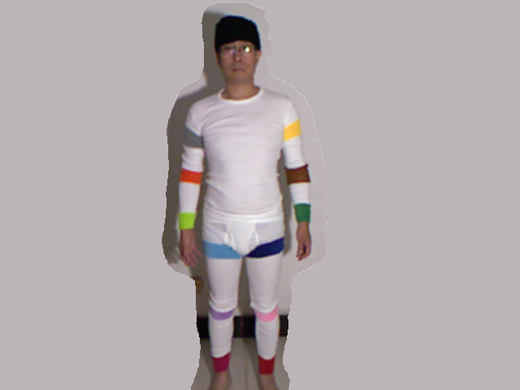

# DragonFly
Kinect motion capture (Mocap) project by color tracking.

I'm studing how to use Kinect xbox 360 to achieve a low cost motion capture system.

In this project, I use both color and depth information to locate the positions of all joints.

The algorithm does not use any statistic math, the positions of all joints are definite and accurate.

I use cheap wrist bands (13 colors) to mark colors for joints, they only costed me less than five dollars.

I found that my clothes are white, so I use a piece of brown non-woven fabric to instead the white wrist band.

Non-woven fabrics have more colors than wrist bands, and they are cheaper than wrist bands.

I recommend that you put the light source near the camera, and let it lighten your body from camera's view.

You need to take a photo on the wrist bands under the light source, than write down their hues, satuations and values, you may use GIMP to get these information.

Then you need to modify 'colortrack.h', find the function of 'Color_Tracker()', fill the colors into the color table instead of mine.

The project is almost mature, play it around for fun.

### Features:
1. Locate positions of all joints by color tracking.
2. Global optimal solution for color tracking.
4. Turn around body in range of 360 degrees.
5. Export to 'BVH' file.

### Support systems:
1. macOS
2. Linux
3. Windows.

### Usage:
1. Install latest [libfreenect driver](https://github.com/OpenKinect/libfreenect/).
2. Install OpenCV 2.4.12
3. Mark joints with different colors.
4. Plug the Kinect xbox 360 device into the USB port.
5. Set path for include directory and lib directory.
6. Fill in the color table by modifying the source code.
7. Build and run.
8. Perform actions.
9. [Optional]Press 's' to take a photo.
10. Press 'Esc' key to exit.
