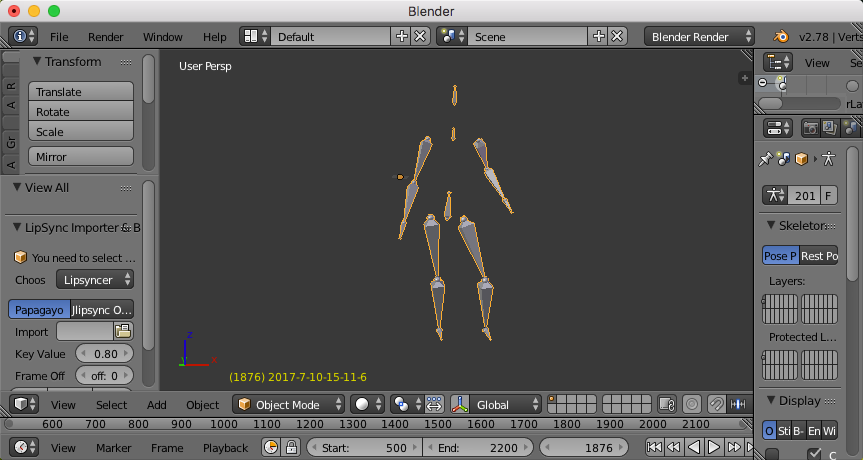

# DragonFly
Kinect motion capture (Mocap) research project by color tracking.

I'm studing how to use Kinect xbox 360 to achieve a low cost motion capture system.

I use both color and depth information to locate the positions of joints.

The algorithm does not use statistic method, so the positions of joints are accurate.

I use wrist bands (13 colors) to mark colors for joints, they costed me only 5 dollars.

I recommend that you put the light source near the camera, and let it lighten your body from camera's angle.

You need to take a photo on the wrist bands under your light source, than write down their hues, satuations and values, you may use gimp to get the information.

Then you need to modify 'colortrack.h', find the function of 'mask_color_by_depth()', fill your colors into the color table.

You can also fine tune the colors to fit the light source by the built-in color learning function.

But this step is optional, if the light is coming from the camera's angle, it is not necessary to fine tune the colors.

The project is far less mature at present, play around at your own risk.

### Features:
1. Locate positions of joints directly by color tracking.
2. Global optimal solution for color recognition.
3. Mixture gaussian model for color learning.
4. Turn around your body in the range of 360 degrees.
5. Export motion capture data to 'BVH' format.

### Support systems:
1. macOS
2. Linux
3. Windows.

### Usage:
1. Install latest [libfreenect driver](https://github.com/OpenKinect/libfreenect/).
2. Install OpenCV 2.4.12
3. Mark joints with different colors.
4. Plug the Kinect xbox 360 device into the USB port.
5. Set path for include directory and lib directory.
6. Fill in the color table via modifying the source code.
7. Build and run.
8. Perform actions.
9. Press 'Esc' key to exit.

### To do:
The result is poor due to dim light.
